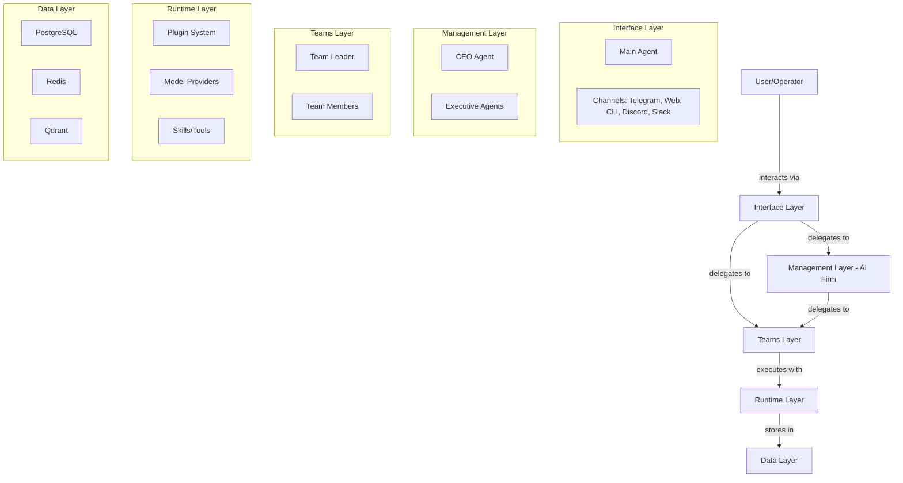
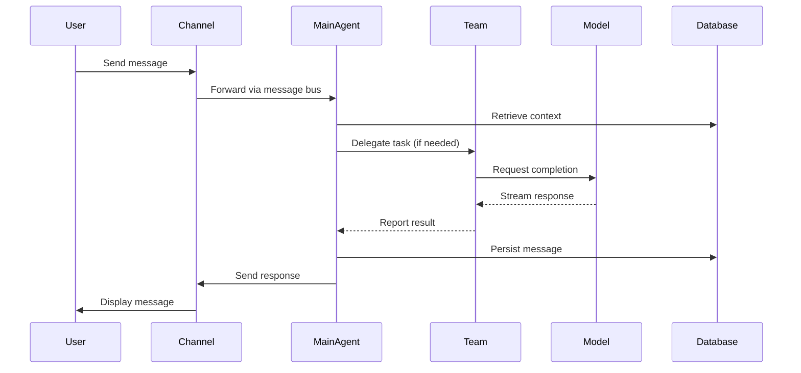
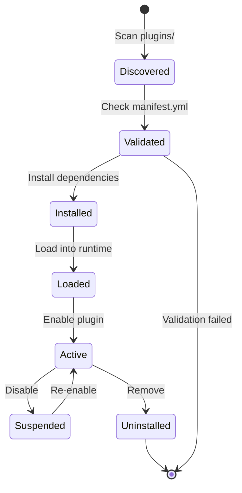
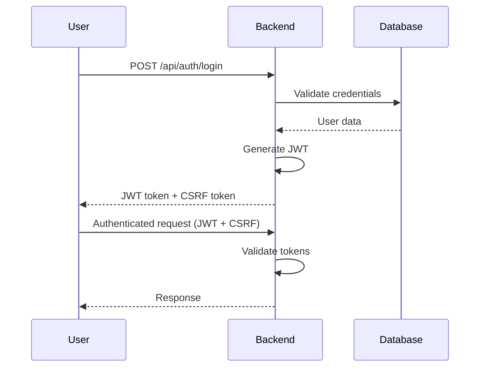

# Architecture Deep Dive

:::info
This document provides a comprehensive technical deep-dive into SYNAPSE's architecture. For a high-level overview, see [Core Concepts → Architecture](../concepts/architecture.md).
:::

## System Philosophy

SYNAPSE operates as an **AI operating system**: a unified runtime where language models, channels, agent teams, and plugins are first-class citizens. Rather than wrapping a single model behind a chat UI, SYNAPSE gives every AI component its own identity, memory, and role.

:::tip Key Metaphor
Just as an OS abstracts hardware and manages resources for applications, SYNAPSE abstracts model APIs and manages context, memory, and coordination for agents.
:::

## System Layers



### 1. Interface Layer (Steel Blue)

The user-facing layer where all interactions begin.

**Components:**
- **Main Agent**: Single point of contact for the user
  - Owns conversation context and session state
  - Routes work to teams, firm, or handles directly
  - Manages plugins, agents, teams through chat commands
  
- **Channels**: Communication platform integrations
  - Each channel is a plugin
  - All events route to Main Agent via message bus
  - Supported: Telegram, Web UI, Discord, Slack, XMPP, CLI

### 2. Management Layer (Violet) [Optional]

The strategic coordination layer for complex projects.

**AI-Firm Structure:**
- **CEO Agent**: Top-level orchestration
- **Executive Agents**: Domain specialists (requirements, alignment, etc.)
- **Internal Teams**: Managed by the firm
- **Board Integration**: GitLab / GitHub / Forgejo
- **Note**: Never communicates directly with users

### 3. Teams Layer (Copper) [Optional, N teams]

Execution units for specialized tasks.

**Team Structure:**
- **Team Leader**: Coordinates team activities
- **Team Members**: Specialized agents
- **Routing Rules**: Defines who can delegate to the team
- **Reporting**: Results flow back to delegating agent

:::warning Team Constraints
Teams cannot bypass the Main Agent unless explicitly configured with `user-direct: true`
:::

### 4. Runtime Layer

Core execution environment.

**Components:**
- **Plugin Manager**: Discovers, loads, validates plugins
- **Model Providers**: OpenAI, Anthropic, Ollama, local models
- **Skill System**: Callable capabilities (web search, code execution, file operations)
- **Message Bus**: Redis-based event streaming

### 5. Data Layer

Persistent storage and caching.

**Storage Systems:**
- **PostgreSQL**: Relational data (agents, conversations, users, tasks)
- **Redis**: Caching, message bus, short-term memory
- **Qdrant**: Vector embeddings, semantic memory

## Configuration-Driven Design

Everything in SYNAPSE is configurable without code changes:

```yaml
# Example: Agent configuration
agent:
  id: code-reviewer
  name: Code Reviewer
  description: Reviews pull requests for best practices
  model:
    provider: anthropic
    model: claude-3-5-sonnet
    temperature: 0.3
  system_prompt: |
    You are an expert code reviewer...
  plugins:
    - github
    - code-analysis
  memory:
    short_term_window: 20
    semantic_results: 5
```

## Message Flow

### Conversation Flow



### Plugin Lifecycle



## Domain-Driven Package Structure

SYNAPSE uses domain-driven design with clear boundaries:

```
dev.synapse/
├── core/
│   ├── bootstrap/           # Application startup, health checks
│   ├── infrastructure/      # Security, logging, events, exceptions
│   └── common/              # Shared domain entities & repositories
│
├── agents/                  # Agent orchestration domain
│   ├── api/                # REST controllers
│   ├── service/            # Business logic
│   ├── domain/             # Domain models
│   └── dto/                # Request/Response objects
│
├── conversation/            # Messaging domain
│   ├── api/
│   ├── service/
│   ├── realtime/           # WebSocket handlers
│   └── dto/
│
├── tasks/                   # Task management domain
├── users/                   # User management & auth domain
├── providers/               # Model provider integrations
└── plugins/                 # Plugin lifecycle domain
```

:::note Architectural Evolution
The package restructure from monolithic `/core` to domain-driven structure is planned for **v2.2.0**.
:::

## Extensibility Points

### 1. Plugin System

Extend SYNAPSE without modifying core:

- **Channel Plugins**: New communication platforms
- **Model Plugins**: AI provider integrations
- **Skill Plugins**: Tools and capabilities
- **MCP Plugins**: Model Context Protocol servers

### 2. Event System

React to system events:

```java
@EventListener
public void onAgentCreated(AgentCreatedEvent event) {
    // Custom logic when agent is created
}
```

### 3. Custom Skills

Add domain-specific capabilities:

```java
@Plugin(name = "weather", version = "1.0.0")
public class WeatherPlugin implements SynapsePlugin {
    @PluginAction(name = "get_weather")
    public PluginResult getWeather(@Parameter(name = "location") String location) {
        // Implementation
    }
}
```

## Performance Considerations

### Caching Strategy

1. **Hot Path**: Recent conversations in Redis (TTL: 1 hour)
2. **Warm Path**: PostgreSQL with connection pooling
3. **Cold Path**: Vector search in Qdrant

### Connection Pooling

```yaml
spring:
  datasource:
    hikari:
      maximum-pool-size: 20
      minimum-idle: 5
      connection-timeout: 30000
```

### Streaming Responses

AI model responses streamed token-by-token via WebSocket for better UX and perceived performance.

## Security Architecture

### Authentication Flow



### Security Layers

1. **Spring Security**: JWT authentication, CSRF protection
2. **Plugin Sandboxing**: Resource limits, permission model
3. **Database Encryption**: At-rest encryption
4. **TLS**: In-transit encryption
5. **Audit Logging**: All mutating operations logged

## Observability (Planned v2.3.0)

### Metrics

- **Micrometer + Prometheus**: System metrics
- **Custom Metrics**: Agent performance, conversation latency
- **Grafana Dashboards**: Visualization

### Tracing

- **Spring Cloud Sleuth**: Distributed tracing
- **Trace IDs**: Correlated across all logs
- **Redis Context**: Trace propagation through message bus

### Logging

- **Structured JSON**: Machine-readable logs
- **Log Levels**: Configurable per package
- **Aggregation-Ready**: ELK, Loki compatible

## Next Steps

- [Contributing Guide](./contributing.md)
- [Development Environment Setup](./environment-setup.md)
- [Database Schema](./database-schema.md)
- [Testing Guide](./testing.md)
