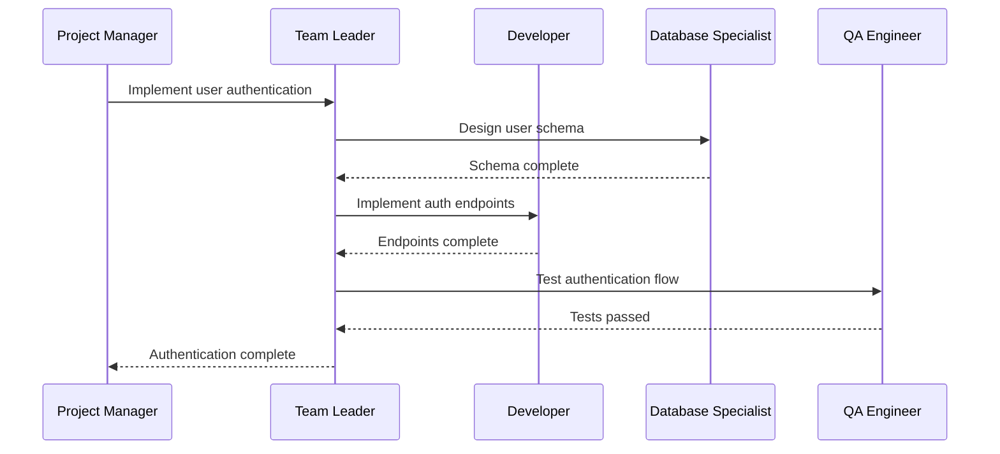
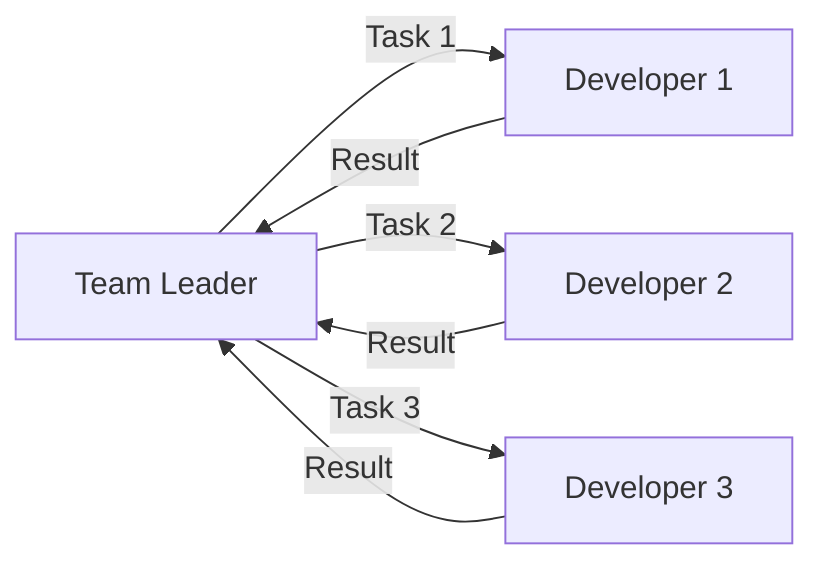
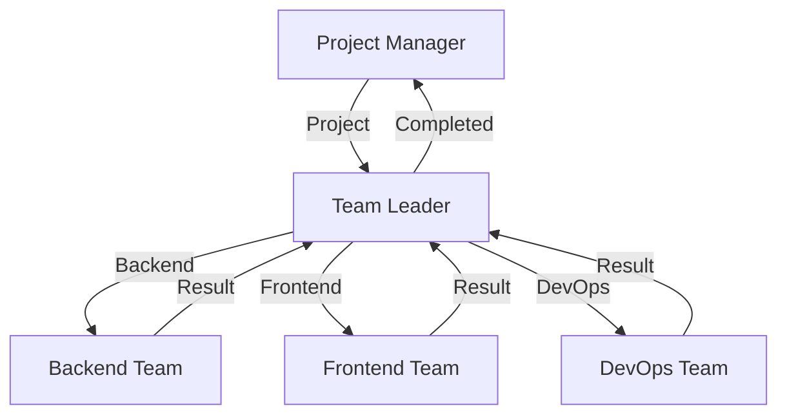

# Team Collaboration Guide

Learn how to create and manage agent teams for complex, multi-step workflows.

:::info What You'll Learn
- How agent teams work in SYNAPSE
- Creating teams via Dashboard and CLI
- Configuring team routing and permissions
- Best practices for team collaboration
:::

## Understanding Agent Teams

Agent teams group a **leader** and **member agents** behind a single routing contract. Teams enable:

- **Division of Labor**: Specialized agents for specific tasks
- **Coordinated Workflows**: Leader orchestrates member activities
- **Scalable Architecture**: Add teams without modifying core

:::tip Key Concept
Teams are **optional** and **unlimited**. You can create as many teams as needed, or none at all.
:::

## Team Structure

Each team is defined by a `team.yml` configuration file:

```yaml
id: "backend-dev-team"
name: "Backend Development Team"
description: "Full-stack backend development with testing"

leader: "backend-lead"
members:
  - "java-developer"
  - "database-specialist"
  - "qa-engineer"

routing:
  receives_from:
    - "main-agent"
    - "project-manager"
  reports_to:
    - "project-manager"
  user_direct: false  # Users cannot address team directly
```

### Team Components

| Field | Description |
|-------|-------------|
| `id` | Kebab-case unique identifier |
| `leader` | Agent ID of the team leader |
| `members` | Array of member agent IDs |
| `routing.receives_from` | Agents allowed to delegate to this team |
| `routing.reports_to` | Agents that receive completed work |
| `routing.user_direct` | Whether users can address team directly |

## Creating Teams

### Via Dashboard (Main Agent Chat)

The easiest way to create a team is through conversation:

```
User: /teams new

Main Agent: Let's create a new agent team. What domain will this team focus on?

User: Backend development with Java and Spring Boot

Main Agent: Great! What should the team leader be called?

User: Backend Lead

Main Agent: Who should be team members? (comma-separated IDs or "create new")

User: java-developer, database-specialist, qa-engineer

Main Agent: Who should be allowed to send work to this team?

User: project-manager, main-agent

Main Agent: Should this team report to a specific agent?

User: project-manager

Main Agent: Should users be able to address this team directly?

User: No

Main Agent: ✅ Created Backend Development Team
- Leader: backend-lead
- Members: 3 agents
- Routing: Receives from 2 agents, reports to project-manager
```

### Via CLI

```bash
# Interactive team creation
synapse teams new

# Follow prompts...
```

### Manual Configuration

Advanced users can create teams directly:

1. **Create team directory:**
   ```bash
   mkdir -p agents/teams/backend-dev-team
   ```

2. **Create `team.yml`:**
   ```yaml
   id: "backend-dev-team"
   name: "Backend Development Team"
   description: "Java backend development team"
   
   leader: "backend-lead"
   members:
     - "java-developer"
     - "database-specialist"
   
   routing:
     receives_from: ["main-agent"]
     reports_to: ["main-agent"]
     user_direct: false
   ```

3. **Create leader agent:**
   ```yaml
   # agents/backend-lead/config.yml
   id: "backend-lead"
   name: "Backend Lead"
   model:
     provider: "anthropic"
     model: "claude-3-5-sonnet"
   system_prompt: |
     You are the backend development team leader.
     Coordinate Java developers, database specialists, and QA engineers.
     Break down tasks and delegate to team members.
   ```

4. **Reload agents:**
   ```bash
   synapse agents reload
   ```

## Team Workflows

### Sequential Workflow

Team leader delegates tasks in sequence:



### Parallel Workflow

Multiple members work simultaneously:



### Hierarchical Delegation

Team leader delegates to sub-teams:



## Team Routing Rules

### receives_from

Controls who can delegate work to the team:

```yaml
routing:
  receives_from:
    - "main-agent"      # Main agent can delegate
    - "project-manager" # PM can delegate
    - "ceo-agent"       # CEO (if AI-Firm exists)
```

:::warning Routing Constraint
If `receives_from` is empty, **only the Main Agent** can delegate to the team.
:::

### reports_to

Defines where completed work is sent:

```yaml
routing:
  reports_to:
    - "project-manager"  # Send completed work to PM
```

If not specified, results return to the delegating agent.

### user_direct

Allow users to address the team directly:

```yaml
routing:
  user_direct: true  # Users can chat with team
```

:::caution Security Consideration
Setting `user_direct: true` bypasses the Main Agent. Use carefully to maintain conversation context.
:::

## Example: Software Development Team

Complete configuration for a full-stack development team:

```yaml
# agents/teams/fullstack-team/team.yml
id: "fullstack-team"
name: "Full-Stack Development Team"
description: "Complete web application development team"

leader: "tech-lead"

members:
  - "frontend-developer"
  - "backend-developer"
  - "ux-designer"
  - "qa-engineer"
  - "devops-engineer"

routing:
  receives_from:
    - "main-agent"
    - "product-manager"
  reports_to:
    - "product-manager"
  user_direct: false

metadata:
  domain: "Web Development"
  specialization: "Full-Stack JavaScript"
  tools:
    - React
    - Node.js
    - PostgreSQL
    - Docker
```

**Team Leader Prompt:**

```yaml
# agents/tech-lead/soul.md
You are the Technical Lead of a full-stack development team.

Your team members:
- Frontend Developer: React, Vue, TypeScript
- Backend Developer: Node.js, Express, NestJS
- UX Designer: User experience and interface design
- QA Engineer: Testing and quality assurance
- DevOps Engineer: CI/CD, deployment, infrastructure

When you receive a project:
1. Break it into tasks (frontend, backend, design, testing, deployment)
2. Delegate tasks to appropriate team members
3. Monitor progress and coordinate handoffs
4. Ensure code quality and best practices
5. Report completed work to the product manager

Communicate clearly, document decisions, and keep the product manager updated.
```

## Best Practices

### 1. Clear Team Boundaries

Each team should have a well-defined domain:

✅ **Good:**
- "Authentication Team" - handles all auth-related tasks
- "Payment Team" - handles payment processing
- "Analytics Team" - handles data analysis

❌ **Bad:**
- "General Team" - too vague
- "Everything Team" - no boundaries

### 2. Appropriate Team Size

Keep teams manageable:

- **Small teams (2-3 members)**: Simple, focused tasks
- **Medium teams (4-6 members)**: Complex projects
- **Large teams (7+ members)**: Enterprise-scale initiatives

### 3. Leader Coordination

Team leaders should:
- Understand each member's capabilities
- Delegate based on expertise
- Monitor progress and unblock members
- Synthesize results for reporting

### 4. Routing Discipline

Maintain clear routing:

```yaml
# Clear chain of command
routing:
  receives_from: ["project-manager"]  # Single source of work
  reports_to: ["project-manager"]      # Single destination
  user_direct: false                   # No bypassing
```

### 5. Documentation

Document team structure and workflows:

```yaml
# teams/backend-team/README.md
# Backend Development Team

## Purpose
Build and maintain the Java Spring Boot backend.

## Members
- **Backend Lead**: Coordinates development
- **API Developer**: Designs REST endpoints
- **Database Developer**: Manages schema and queries
- **QA Engineer**: Tests backend functionality

## Workflow
1. PM assigns feature to Backend Lead
2. Lead breaks down into tasks
3. API Developer implements endpoints
4. Database Developer creates migrations
5. QA Engineer writes tests
6. Lead reviews and reports completion
```

## Team Management

### Monitoring Team Activity

```bash
# View team status
synapse teams list

# Check team members
synapse teams show backend-dev-team

# View team activity log
synapse logs --team backend-dev-team
```

### Updating Teams

```bash
# Add team member
synapse teams add-member backend-dev-team new-developer

# Remove team member
synapse teams remove-member backend-dev-team old-developer

# Update routing
synapse teams update backend-dev-team --receives-from main-agent,pm
```

### Dissolving Teams

```bash
# Dissolve team (keeps member agents)
synapse teams dissolve backend-dev-team
```

## Logging and Observability

Team events are logged for audit and debugging:

```
[2026-05-10 11:30:00] AGENT_TEAM team=backend-dev-team event=created leader=backend-lead members=3
[2026-05-10 11:35:00] AGENT_TEAM team=backend-dev-team event=task_received from=project-manager
[2026-05-10 11:36:00] AGENT_TEAM team=backend-dev-team event=task_delegated to=java-developer
[2026-05-10 11:45:00] AGENT_TEAM team=backend-dev-team event=task_completed by=java-developer
[2026-05-10 11:46:00] AGENT_TEAM team=backend-dev-team event=report_submitted to=project-manager
```

## Troubleshooting

### Team Not Receiving Work

**Problem:** Task sent to team, but team doesn't respond.

**Solution:**
1. Check `receives_from` includes delegating agent
2. Verify team leader agent exists and is active
3. Check logs for routing errors

```bash
synapse logs --team your-team --level ERROR
```

### Member Agent Not Found

**Problem:** Team references non-existent member.

**Solution:**
1. Verify all member IDs exist:
   ```bash
   synapse agents list | grep member-id
   ```
2. Create missing agents or update team configuration

### Circular Delegation

**Problem:** Team A delegates to Team B, which delegates back to Team A.

**Solution:**
1. Review team routing configurations
2. Establish clear hierarchy
3. Avoid circular `receives_from` / `reports_to`

## Advanced: AI-Firm Integration

Teams can be managed by an AI-Firm (optional management layer):

```yaml
# AI-Firm manages multiple teams
firm:
  ceo: "ceo-agent"
  teams:
    - "backend-dev-team"
    - "frontend-dev-team"
    - "devops-team"
```

See [AI-Firm System Documentation](./ai-firm-system.md) (coming soon) for details.

## Next Steps

- [Agent Concepts](../concepts/agents.md)
- [Agent Management](./agent-management.md)
- [Conversation System](../concepts/conversations.md)
- [Plugin Development](./plugin-development.md)

