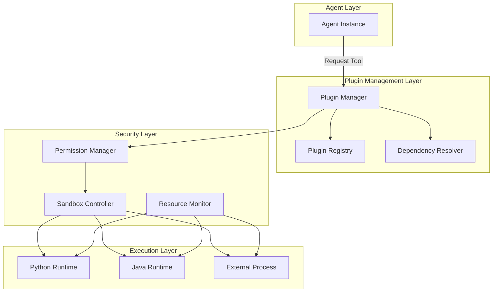
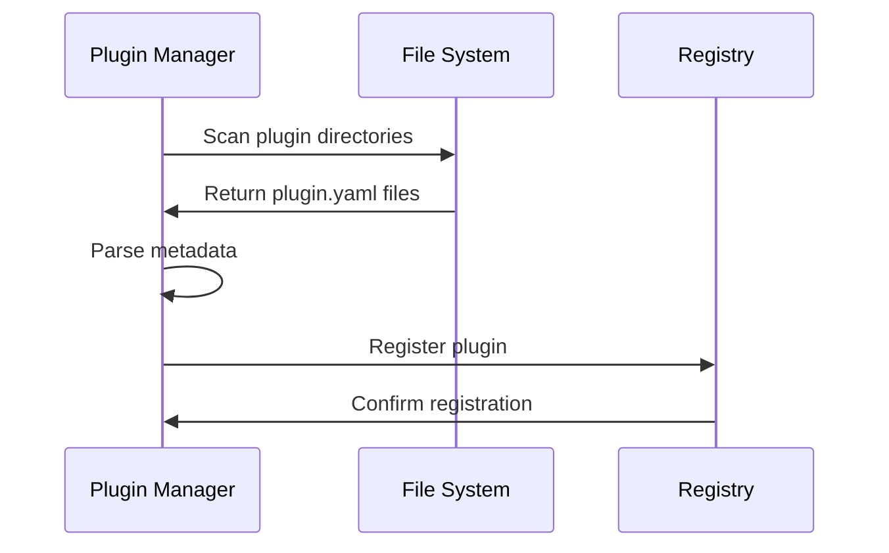
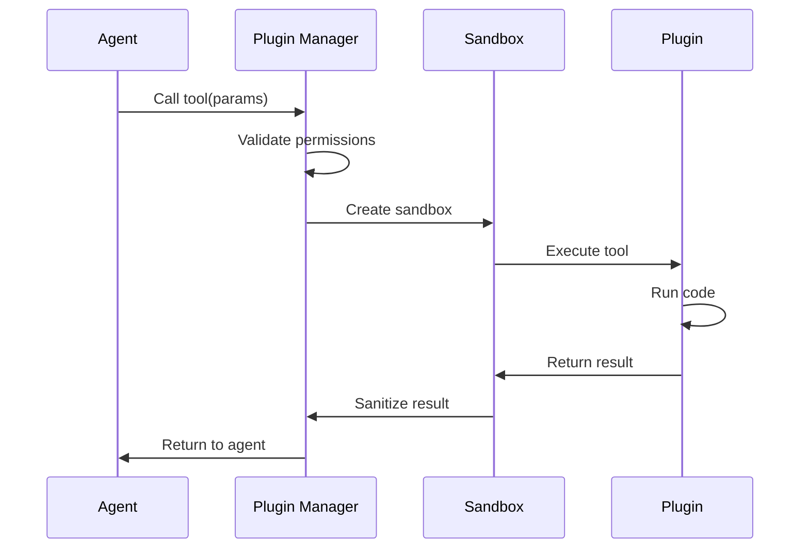

# Plugin Architecture

Technical overview of SYNAPSE's plugin system architecture.

## System Overview



## Plugin Lifecycle

### 1. Discovery



### 2. Loading

Plugins are loaded lazily on first use:

1. **Metadata Validation**: Check plugin.yaml syntax and required fields
2. **Dependency Resolution**: Ensure all dependencies are available
3. **Version Compatibility**: Verify SYNAPSE version compatibility
4. **Security Check**: Validate permissions and sandbox requirements
5. **Code Loading**: Load plugin code into runtime

### 3. Execution



### 4. Cleanup

- **Resource Release**: Free memory and file handles
- **Sandbox Teardown**: Remove temporary files and processes
- **Metric Collection**: Log execution time and resource usage

## Plugin Structure

### Required Files

```
my-plugin/
├── plugin.yaml          # Plugin metadata
├── src/
│   ├── __init__.py     # Plugin entry point (Python)
│   └── tools/          # Tool implementations
├── tests/              # Plugin tests
├── requirements.txt    # Python dependencies (optional)
├── pom.xml            # Java dependencies (optional)
└── README.md          # Documentation
```

### Plugin Metadata (plugin.yaml)

```yaml
name: my-plugin
version: 1.0.0
description: My custom plugin
author: Your Name
license: MIT

# SYNAPSE version compatibility
synapse_version: ">=2.0.0"

# Runtime
runtime: python  # or java

# Entry point
entry_point: src.my_plugin.MyPlugin

# Tools provided
tools:
  - name: my_tool
    description: Does something useful
    parameters:
      - name: input
        type: string
        required: true

# Dependencies
dependencies:
  python:
    - requests>=2.31.0
    - beautifulsoup4>=4.12.0
  plugins:
    - web-search>=1.0.0

# Security
permissions:
  - network.http
  - filesystem.read
  - filesystem.write:/tmp

# Resource limits
limits:
  memory_mb: 512
  cpu_percent: 50
  timeout_seconds: 30
```

## Security Model

### Permission System

Plugins must declare required permissions:

- `network.http`: HTTP/HTTPS requests
- `network.socket`: Raw socket access
- `filesystem.read`: Read files
- `filesystem.write:<path>`: Write to specific paths
- `process.spawn`: Create subprocesses
- `database.read`: Read from database
- `database.write`: Write to database

### Sandbox Isolation

Plugins run in isolated environments with resource limits and restricted access.
