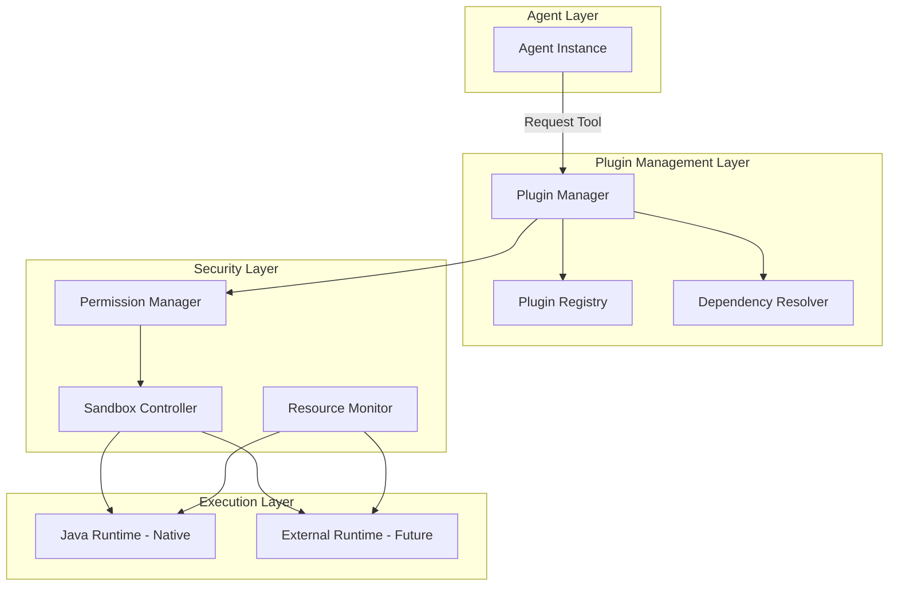
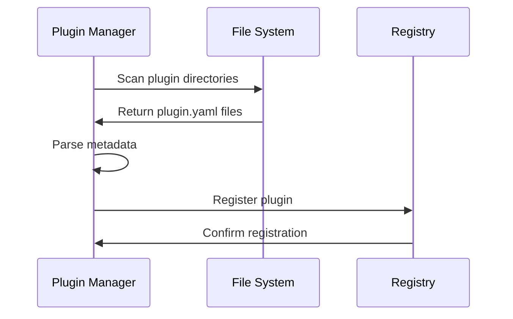
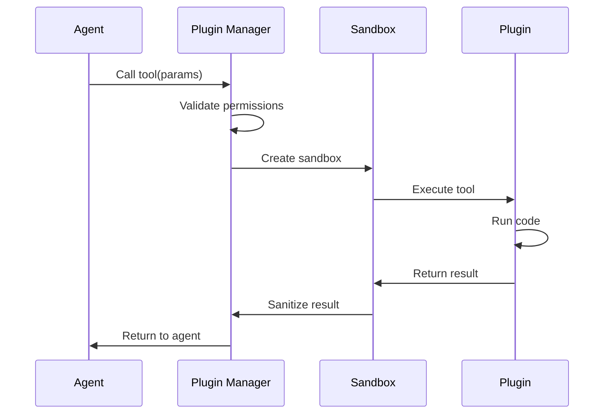

# Plugin Architecture

Technical overview of SYNAPSE's plugin system architecture.

:::info Java-First Architecture
SYNAPSE follows a **Java-first plugin architecture** with native JVM integration.  
For details on the language strategy and future multi-language support, see:  
📋 [Plugin Language Strategy](https://github.com/FTMahringer/Synapse/blob/main/ideas/plugin-language-strategy.md)
:::

## System Overview



## Plugin Lifecycle

### 1. Discovery



### 2. Loading

Plugins are loaded lazily on first use:

1. **Metadata Validation**: Check plugin.yaml syntax and required fields
2. **Dependency Resolution**: Ensure all dependencies are available
3. **Version Compatibility**: Verify SYNAPSE version compatibility
4. **Security Check**: Validate permissions and sandbox requirements
5. **Code Loading**: Load plugin code into runtime

### 3. Execution



### 4. Cleanup

- **Resource Release**: Free memory and file handles
- **Sandbox Teardown**: Remove temporary files and processes
- **Metric Collection**: Log execution time and resource usage

## Plugin Structure

### Java Plugin Structure (Current)

```
my-plugin/
├── plugin.yml                    # Plugin metadata
├── build.gradle                  # Gradle build configuration
├── settings.gradle               # Gradle settings
├── src/
│   ├── main/
│   │   ├── java/                # Plugin source code
│   │   │   └── dev/synapse/plugin/
│   │   │       └── MyPlugin.java
│   │   └── resources/
│   │       └── application.yml  # Spring Boot configuration
│   └── test/
│       └── java/                # Unit tests
├── docs/                        # Plugin documentation
├── examples/                    # Usage examples
└── README.md                    # Project documentation
```

### External Plugin Structure (Future v2.7.0+)

For future multi-language support via external runtime:
```
my-plugin/
├── plugin.yaml          # Plugin metadata
├── src/                 # Source code (any language)
├── tests/               # Plugin tests
└── README.md           # Documentation
```

### Plugin Metadata (plugin.yml)

```yaml
# Plugin Identity
name: my-plugin
version: 1.0.0
description: My custom SYNAPSE plugin
author: Your Name
license: MIT
homepage: https://github.com/YourOrg/my-plugin

# SYNAPSE version compatibility
synapse_version: ">=2.6.0"

# Runtime (currently only 'java' supported)
runtime: java

# Java Entry Point
main_class: dev.synapse.plugin.MyPlugin

# Tools provided by this plugin
tools:
  - name: my_tool
    description: Does something useful
    parameters:
      - name: input
        type: string
        required: true
        description: Input parameter

# Dependencies
dependencies:
  # Other SYNAPSE plugins this plugin depends on
  plugins:
    - web-search>=1.0.0
  # Java/Maven dependencies (managed in build.gradle)
  # External dependencies listed here for visibility

# Security
permissions:
  - network.http
  - filesystem.read
  - filesystem.write:/tmp

# Resource limits
limits:
  memory_mb: 512
  cpu_percent: 50
  timeout_seconds: 30
```

## Security Model

### Permission System

Plugins must declare required permissions:

- `network.http`: HTTP/HTTPS requests
- `network.socket`: Raw socket access
- `filesystem.read`: Read files
- `filesystem.write:<path>`: Write to specific paths
- `process.spawn`: Create subprocesses
- `database.read`: Read from database
- `database.write`: Write to database

### Sandbox Isolation

Plugins run in isolated environments with resource limits and restricted access.
