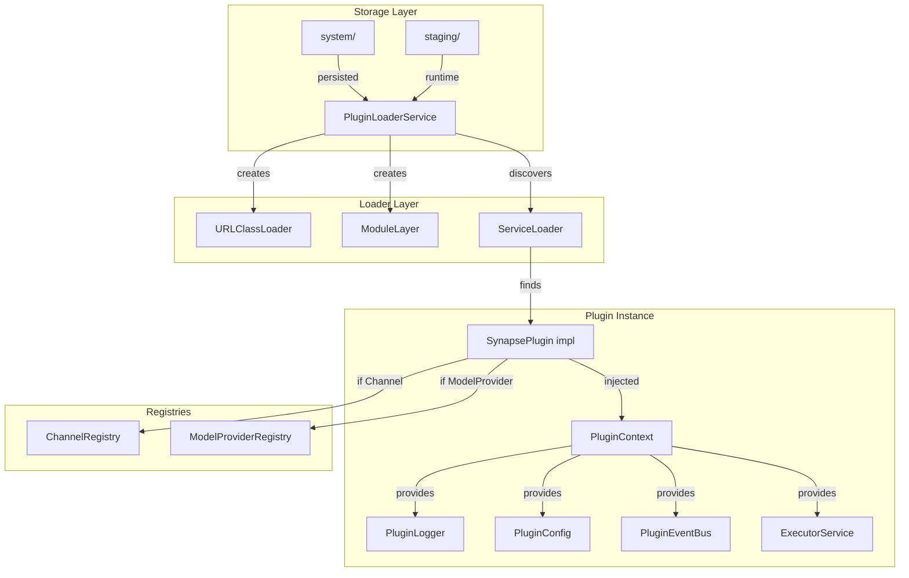

# Plugin Loader

The SYNAPSE Plugin Loader is responsible for dynamically loading plugin JARs into isolated JVM environments at runtime. Each plugin receives its own `ClassLoader` and JPMS `ModuleLayer`, ensuring strict separation from core code and other plugins.

## Architecture



## Storage Layout

```
$SYNAPSE_HOME/plugins/
├── system/          ← persisted across restarts
│   ├── telegram-channel-1.2.0.jar
│   └── anthropic-provider-1.0.0.jar
└── staging/         ← runtime-installed this session
    └── discord-channel-0.9.0.jar
```

| Directory | Purpose | Persistence |
|---|---|---|
| `system/` | Production plugins | Survives restarts |
| `staging/` | Newly installed plugins | Promoted to `system/` on graceful shutdown |

### Staging → System Migration

| Event | Behavior |
|---|---|
| Runtime install | JAR placed in `staging/`, soft-reloaded immediately |
| Graceful shutdown | All `staging/` JARs migrated to `system/` |
| Hard crash / kill | `staging/` JARs remain; admin prompted on next start |
| Clean startup | Only `system/` JARs loaded automatically |

## Startup Load Sequence

```
1. Check for orphaned staging JARs (crash recovery warning)
2. Scan system/ for JAR files
3. Parse + validate each manifest
4. For each JAR: find DB record → load → register in registries
5. Log summary of loaded / failed plugins
```

## Loading Isolation

Each plugin JAR is loaded into its own isolated environment:

1. **URLClassLoader** — parent is the platform class loader (not the app class loader)
2. **JPMS ModuleLayer** — only `synapse.plugin.api` is accessible
3. **ServiceLoader discovery** — finds `SynapsePlugin` implementations
4. **Context injection** — `PluginContext` with logger, config, event bus, executor

Plugins **cannot** access:
- Spring beans or application context
- JPA repositories or database connections
- Redis clients
- Internal service classes
- Other plugins' classes (unless explicitly shared via API)

## Loader States

| State | Description |
|---|---|
| `UNLOADED` | Plugin is installed but not loaded into JVM |
| `LOADING` | Plugin is currently being loaded |
| `LOADED` | Plugin is active and running |
| `ERROR` | Plugin failed to load; check `errorMessage` |

## REST API

### List Loader Status

```http
GET /api/plugins/loader/status
```

Returns all currently loaded plugins with runtime information.

### Load a Plugin

```http
POST /api/plugins/{id}/load
```

Loads a plugin from its stored JAR into the JVM.

### Unload a Plugin

```http
POST /api/plugins/{id}/unload
```

Unloads a plugin, calling `onUnload()` and closing its ClassLoader.

### Reload a Plugin

```http
POST /api/plugins/{id}/reload
```

Unloads and reloads a plugin (useful for config updates).

### Check Orphaned JARs

```http
GET /api/plugins/loader/orphans
```

Returns orphaned staging JARs from a previous crash.

### Promote Staging JARs

```http
POST /api/plugins/loader/promote
```

Manually promotes all staging JARs to system/.

## PluginContext

The `PluginContext` is the only bridge between a plugin and SYNAPSE core:

| Method | Purpose |
|---|---|
| `logger()` | Scoped logger tagged with plugin id |
| `config()` | Typed config wrapper from manifest |
| `eventBus()` | Publish/subscribe to platform events |
| `executor()` | Bounded virtual thread pool |
| `authMode()` | Active authentication mode |
| `routeMessage()` | Route inbound messages to agents |

## Resource Limits

Resource limits are enforced per trust tier:

| Limit | Official | Community |
|---|---|---|
| Concurrent virtual threads | 25 | 10 |
| Lifecycle hook timeout | 30s | 10s |
| Message handler timeout | 60s | 30s |

## Crash Recovery

If the JVM crashes while plugins are in `staging/`, the next startup will:

1. Detect orphaned JARs in `staging/`
2. Log a warning with the list of orphaned files
3. **Not** auto-promote them (admin decision required)
4. Continue loading only `system/` JARs

Admins can review orphans via the API and manually promote them.

## Error Handling

When a plugin fails to load:

1. The plugin's `loaderState` is set to `ERROR`
2. `errorMessage` contains the diagnostic
3. The plugin is **not** registered in any registry
4. The ClassLoader is closed to free resources
5. An event is published for monitoring

Example error response:
```json
{
  "id": "my-plugin",
  "loaderState": "ERROR",
  "errorMessage": "JAR contains no module descriptor (module-info.class). Plugins must declare a JPMS module."
}
```
