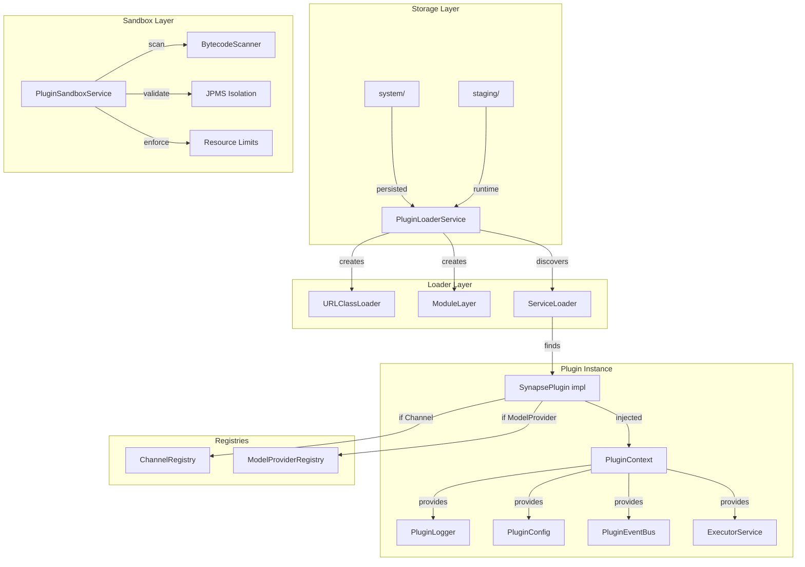

# Plugin Loader

The SYNAPSE Plugin Loader is responsible for dynamically loading plugin JARs into isolated JVM environments at runtime. Each plugin receives its own `ClassLoader` and JPMS `ModuleLayer`, ensuring strict separation from core code and other plugins.

## Architecture



## Storage Layout

```
$SYNAPSE_HOME/plugins/
├── system/          ← persisted across restarts
│   ├── telegram-channel-1.2.0.jar
│   └── anthropic-provider-1.0.0.jar
└── staging/         ← runtime-installed this session
    └── discord-channel-0.9.0.jar
```

| Directory | Purpose | Persistence |
|---|---|---|
| `system/` | Production plugins | Survives restarts |
| `staging/` | Newly installed plugins | Promoted to `system/` on graceful shutdown |

### Staging → System Migration

| Event | Behavior |
|---|---|
| Runtime install | JAR placed in `staging/`, soft-reloaded immediately |
| Graceful shutdown | All `staging/` JARs migrated to `system/` |
| Hard crash / kill | `staging/` JARs remain; admin prompted on next start |
| Clean startup | Only `system/` JARs loaded automatically |

## Startup Load Sequence

```
1. Check for orphaned staging JARs (crash recovery warning)
2. Scan system/ for JAR files
3. Parse + validate each manifest
4. For each JAR: find DB record → load → register in registries
5. Log summary of loaded / failed plugins
```

## Loading Isolation

Each plugin JAR is loaded into its own isolated environment:

1. **URLClassLoader** — parent is the platform class loader (not the app class loader)
2. **JPMS ModuleLayer** — only `synapse.plugin.api` is accessible
3. **ServiceLoader discovery** — finds `SynapsePlugin` implementations
4. **Context injection** — `PluginContext` with logger, config, event bus, executor

Plugins **cannot** access:
- Spring beans or application context
- JPA repositories or database connections
- Redis clients
- Internal service classes
- Other plugins' classes (unless explicitly shared via API)

## Loader States

| State | Description |
|---|---|
| `UNLOADED` | Plugin is installed but not loaded into JVM |
| `LOADING` | Plugin is currently being loaded |
| `LOADED` | Plugin is active and running |
| `ERROR` | Plugin failed to load; check `errorMessage` |

## REST API

### List Loader Status

```http
GET /api/plugins/loader/status
```

Returns all currently loaded plugins with runtime information.

### Load a Plugin

```http
POST /api/plugins/{id}/load
```

Loads a plugin from its stored JAR into the JVM.

### Unload a Plugin

```http
POST /api/plugins/{id}/unload
```

Unloads a plugin, calling `onUnload()` and closing its ClassLoader.

### Reload a Plugin

```http
POST /api/plugins/{id}/reload
```

Unloads and reloads a plugin (useful for config updates).

### Check Orphaned JARs

```http
GET /api/plugins/loader/orphans
```

Returns orphaned staging JARs from a previous crash.

### Promote Staging JARs

```http
POST /api/plugins/loader/promote
```

Manually promotes all staging JARs to system/.

### Resolve Dependencies

```http
POST /api/plugins/{id}/resolve-deps
```

Resolves the dependency chain for a plugin, returning:
- `success` — whether resolution passed
- `items` — per-dependency status (`SATISFIED`, `MISSING`, `UPDATE_PROMPT`, `BLOCK`, `SKIP_SOFT`)
- `installOrder` — topological order for installation
- `hasUpdatePrompts` — whether any dependency needs updating

Example response:
```json
{
  "pluginId": "my-bundle",
  "success": true,
  "items": [
    { "dependencyId": "telegram-channel", "versionSpec": ">=1.0.0", "action": "SATISFIED", "installedVersion": "1.2.0" },
    { "dependencyId": "openai-provider", "versionSpec": "^2.0.0", "action": "UPDATE_PROMPT", "installedVersion": "1.9.0" }
  ],
  "installOrder": ["telegram-channel", "openai-provider"],
  "hasUpdatePrompts": true
}
```

### Update Plugin

```http
POST /api/plugins/{id}/update
Content-Type: application/json

{ "jarPath": "/path/to/new-version.jar" }
```

Updates a plugin to a new JAR version. The flow:
1. Unload current plugin (if loaded)
2. Delete old JAR
3. Stage new JAR
4. Load new plugin
5. Register in appropriate registry
6. Promote to system/

### Check Slot Clash

```http
POST /api/plugins/check-slot-clash
Content-Type: application/json

{ "id": "my-channel", "slots": { "channel_id": "telegram" } }
```

Checks if a manifest would conflict with already-claimed channel or provider slots.

Returns `hasClash: true` if the slot is already taken by another plugin.

## PluginContext

The `PluginContext` is the only bridge between a plugin and SYNAPSE core:

| Method | Purpose |
|---|---|
| `logger()` | Scoped logger tagged with plugin id |
| `config()` | Typed config wrapper from manifest |
| `eventBus()` | Publish/subscribe to platform events |
| `executor()` | Bounded virtual thread pool |
| `authMode()` | Active authentication mode |
| `routeMessage()` | Route inbound messages to agents |

## Resource Limits

Resource limits are enforced per trust tier:

| Limit | Official | Community |
|---|---|---|
| Concurrent virtual threads | 25 | 10 |
| Lifecycle hook timeout | 30s | 10s |
| Message handler timeout | 60s | 30s |

## Dependency Resolution

Plugins declare dependencies in their manifest:

```yaml
requires:
  plugins:
    - id: telegram-channel
      version: ">=1.0.0"
    - id: openai-provider
      version: "^2.0.0"
  soft_requires:
    - id: image-generation-skill
      version: ">=0.5.0"
```

### Hard Dependencies

Hard dependencies **must** be satisfied before install:
- If missing → install blocked
- If version mismatch → update prompt or block
- Transitive deps are resolved recursively

### Soft Dependencies

Soft dependencies are optional:
- Plugin loads even if the dependency is missing
- A notification is sent via `PluginEventBus` when the dependency appears later

### Version Constraints

Supported operators:

| Operator | Meaning | Example |
|---|---|---|
| `*` | Any version | `*` |
| `1.0.0` | Exact match | `1.0.0` |
| `>=1.0.0` | Greater than or equal | `>=1.0.0` |
| `>1.0.0` | Greater than | `>1.0.0` |
| `<=1.0.0` | Less than or equal | `<=1.0.0` |
| `<1.0.0` | Less than | `<1.0.0` |
| `^1.0.0` | Compatible (same major) | `^1.0.0` matches `1.2.0` |
| `~1.0.0` | Approximately (same major.minor) | `~1.0.0` matches `1.0.5` |

### Conflict Resolution

| Scenario | Action |
|---|---|
| Installed version satisfies constraint | Proceed (`SATISFIED`) |
| Installed version is older than required | Show update prompt (`UPDATE_PROMPT`) |
| Installed version is newer than required | Hard block — downgrade not supported (`BLOCK`) |
| Dependency missing (hard) | Block install (`MISSING`) |
| Dependency missing (soft) | Skip, notify later (`SKIP_SOFT`) |
| Circular dependency detected | Block with full cycle path (`CYCLE_DETECTED`) |
| Slot already claimed by another plugin | Hard block (`SLOT_CLASH`) |

## Crash Recovery

If the JVM crashes while plugins are in `staging/`, the next startup will:

1. Detect orphaned JARs in `staging/`
2. Log a warning with the list of orphaned files
3. **Not** auto-promote them (admin decision required)
4. Continue loading only `system/` JARs

Admins can review orphans via the API and manually promote them.

## Sandboxing

Plugins are sandboxed at multiple layers:

### Bytecode Scanning

Before any plugin is loaded, its JAR is scanned with ASM for forbidden references:

| Forbidden Package | Reason |
|---|---|
| `sun.*`, `com.sun.*` | Internal JDK APIs |
| `org.springframework.*` | Core framework internals |
| `org.hibernate.*`, `jakarta.persistence.*` | Database access |
| `org.postgresql.*` | Database driver internals |
| `io.lettuce.*`, `redis.clients.*` | Redis internals |
| `dev.synapse.core.*`, `dev.synapse.agents.*`, etc. | Core SYNAPSE services |

Allowed packages: `dev.synapse.plugin.api.*`, `java.*`, `javax.*`, `jdk.*`, `org.slf4j.*`

Scan a JAR before install:
```http
POST /api/plugins/sandbox/scan
Content-Type: application/json

{ "jarPath": "/path/to/plugin.jar" }
```

Response:
```json
{
  "clean": false,
  "violations": [
    { "classFile": "com/evil/Stealer.class", "reference": "org.springframework.jdbc.core.JdbcTemplate", "type": "CLASS_REFERENCE" }
  ]
}
```

### JPMS Isolation

At load time, the plugin's `ModuleLayer` is validated to ensure it cannot resolve core modules. If isolation is breached, the load is aborted.

### Resource Limits

Limits are enforced per trust tier:

| Limit | Official | Community |
|---|---|---|
| Lifecycle hook timeout | 30s | 10s |
| Message handler timeout | 60s | 30s |
| Max logs per minute | 1000 | 300 |

If `onLoad()` times out, the plugin is marked `ERROR` and disabled.

Get limits for a plugin:
```http
GET /api/plugins/{id}/sandbox/limits
```

## Error Handling

When a plugin fails to load:

1. The plugin's `loaderState` is set to `ERROR`
2. `errorMessage` contains the diagnostic
3. The plugin is **not** registered in any registry
4. The ClassLoader is closed to free resources
5. An event is published for monitoring

Example error response:
```json
{
  "id": "my-plugin",
  "loaderState": "ERROR",
  "errorMessage": "JAR contains no module descriptor (module-info.class). Plugins must declare a JPMS module."
}
```
