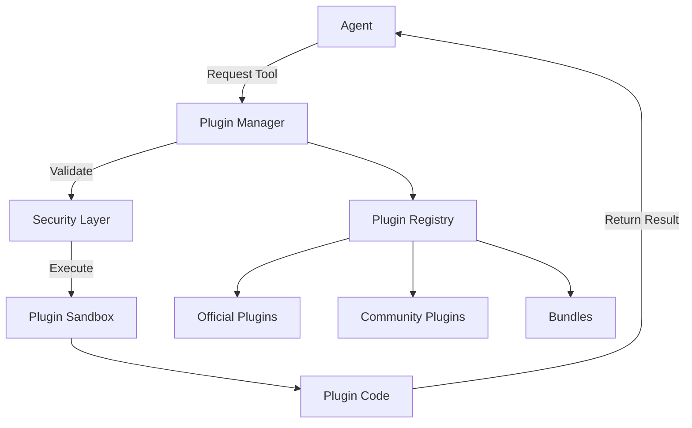

# Plugin Overview

SYNAPSE's plugin system enables you to extend agent capabilities with custom tools, integrations, and behaviors.

## What are Plugins?

Plugins are modular extensions that provide agents with:

- **Tools**: Functions agents can call to perform actions
- **Integrations**: Connections to external services and APIs
- **Data Processors**: Transform and analyze data
- **Custom Behaviors**: Domain-specific logic and workflows

## Plugin Ecosystem

### Official Plugins

Maintained by the SYNAPSE core team with guaranteed compatibility and security:

- **Web Search**: Search the internet for current information
- **File Operations**: Read, write, and manage files
- **Code Execution**: Run code in sandboxed environments
- **API Client**: Make HTTP requests to external APIs

[Browse Official Plugins →](/docs/plugins/official/overview)

### Community Plugins

Created and maintained by the SYNAPSE community:

- Experimental features
- Domain-specific tools
- Third-party integrations
- Custom workflows

[Browse Community Plugins →](/docs/plugins/community/overview)

## Plugin Bundles

Pre-configured collections of related plugins for common use cases:

- **Developer Toolkit**: Git, code analysis, CI/CD tools
- **Data Science Bundle**: Data analysis, visualization, ML tools
- **DevOps Bundle**: Infrastructure management, monitoring, deployment

[View Bundles →](/docs/plugins/bundles/official/overview)

## Plugin Repositories

### Official Plugin Repository

- **Repository**: `FTMahringer/Synapse-plugins` (private)
- **Purpose**: Official, tested, and supported plugins
- **Access**: Available to all SYNAPSE users
- **Quality**: Strict code review and testing standards

### Community Plugin Repository

- **Repository**: `FTMahringer/Synapse-plugins-community` (public)
- **Purpose**: Community-contributed plugins and bundles
- **Access**: Anyone can contribute
- **Quality**: Community review process

:::info Contributing
Want to create a plugin? Check out the [Plugin Development Guide](/docs/plugins/development/getting-started).
:::

## Key Features

### 🔒 Secure Execution

All plugins run in sandboxed environments with:
- Resource limits (CPU, memory, disk)
- Network isolation options
- Permission-based access control
- Execution timeouts

### 🔌 Easy Installation

Install plugins via CLI or web UI:

```bash
synapse plugin install web-search
synapse bundle install developer-toolkit
```

### 📦 Dependency Management

Plugins declare dependencies:
- Python packages (via pip)
- Java libraries (via Maven)
- System packages
- Other plugins

### 🔄 Hot Reload

Update plugins without restarting SYNAPSE:
- Zero-downtime updates
- Version rollback support
- Gradual rollout for teams

## Plugin Architecture



## Getting Started

1. **Install a Plugin**: [Installation Guide](/docs/plugins/development/getting-started#installation)
2. **Use in Agent**: [Agent Configuration](/docs/getting-started/first-agent)
3. **Create Your Own**: [Plugin Tutorial](/docs/plugins/development/plugin-tutorial)
